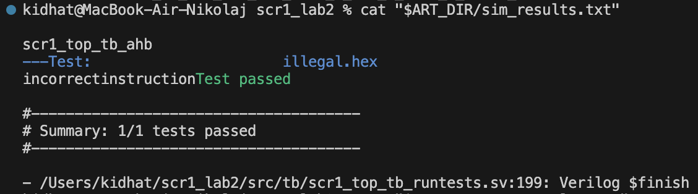
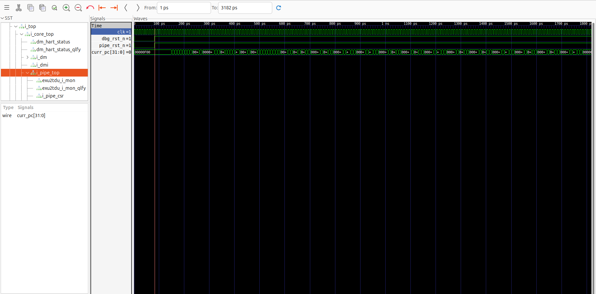

# Лабораторная работа 2 (SCR1)

## Вариант
- ФИО: Николай Байдашев
- Номер варианта: 8
- Тип исключения: `Illegal instruction`
- Тест: `isa/rv32mi/illegal.S`
- `ResetVector`: `0xF00`
- `TrapVector`: `0xB00`
- Требуемый вывод обработчика: `incorrectinstruction`

## Что было сделано
1. Создана ветка `lab_scr1_sim`.
2. Инициализированы submodules (`riscv-tests`, `riscv-compliance`, `riscv-arch`, `coremark`).
3. Для запуска оставлен только тест варианта:
- `sim/tests/riscv_isa/rv32_tests.inc` -> `isa/rv32mi/illegal.S`
4. Изменены параметры архитектуры:
- `src/includes/scr1_arch_description.svh`
- `SCR1_ARCH_RST_VECTOR = 0xF00`
- `SCR1_ARCH_MTVEC_BASE = 0xB00`
5. Обновлен линкер под новые адреса:
- `sim/tests/common/link.ld`
- `.text.init` размещен по адресу `0xB00`
- добавлена секция `.text.start` по адресу `0xF00`
6. Изменен обработчик исключений:
- `sim/tests/common/riscv_macros.h`
- для `CAUSE_ILLEGAL_INSTRUCTION` добавлен вывод строки `incorrectinstruction`
7. Обновлены проверки адресов в testbench:
- `src/tb/scr1_top_tb_ahb.sv`
- `src/tb/scr1_top_tb_axi.sv`

## Команды запуска
```bash
cd ~/scr1_lab2
make clean
make run_verilator_wf TARGETS="riscv_isa" TRACE=1 CROSS_PREFIX=riscv64-elf- RISCV_TESTS="$PWD/dependencies/riscv-tests"
```

## Результат выполнения
Фрагмент вывода симуляции:
- `incorrectinstruction`
- `Test passed`
- `Summary: 1/1 tests passed`

## Проверка wave формы
Wave форма открывается из файла:
- `build/verilator_wf_AHB_MAX_imc_IPIC_1_TCM_1_VIRQ_1_TRACE_1/simx.vcd`

Пример запуска:
```bash
gtkwave build/verilator_wf_AHB_MAX_imc_IPIC_1_TCM_1_VIRQ_1_TRACE_1/simx.vcd
```

## Приложенные артефакты
В этой папке (`lab_scr1_sim`) приложены:
- `simx.vcd`
- `sim_results.txt`
- `test_results.txt`
- `tracelog_core_0.log`
- `illegal.dump`


## Подтверждение вывода строки

### Консоль симуляции


### Waveform (GTKWave)
